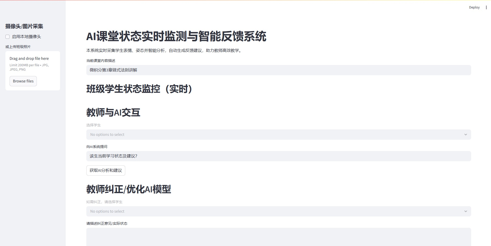

# AI课堂学生状态监控与智能反馈系统  
_A Classroom AI Monitoring and Intelligent Feedback System_



## 简介 | Introduction

本项目基于人工智能多模态识别与大语言模型（如通义千问/ChatGPT），实现对课堂学生状态的**实时监控、智能分析与个性化教学反馈**。适用于智慧教育、课堂管理创新、教学科研等多种场景。

This project leverages AI-powered face and emotion recognition plus LLM-driven natural language analysis to provide **real-time classroom student state monitoring, intelligent feedback, and personalized teacher suggestions**. Suitable for smart education, classroom management, and educational research.

---

## 主要功能 | Features

- 📸 支持摄像头/照片上传，多学生表情与姿态自动识别  
- 🧑‍🎓 每个学生自动编号，画框定位，状态颜色分级直观预警  
- 😃 基于深度学习的情绪识别（DeepFace），分析学生情绪/专注度  
- 🤖 大语言模型智能反馈（支持OpenAI/通义千问等API）  
- 📝 自动生成个性化教学建议，提升教学互动和管理效率  
- 🗣️ 教师可自然语言提问，AI实时作答  
- ⚠️ 状态异常自动报警提醒  
- 🌈 Web界面美观易用，支持多端部署

---

## 环境依赖 | Requirements

- Python 3.9~3.10（推荐虚拟环境运行）
- [Streamlit](https://streamlit.io/) >=1.24
- OpenCV >=4.7
- face_recognition
- deepface
- numpy
- Pillow
- requests
- transformers（如用HuggingFace模型）
- 其它见 `requirements.txt`

_推荐环境：Windows 10/11 或 Ubuntu 20.04+_

---

## 快速开始 | Quick Start

1. 克隆项目 | Clone the repo
   ```bash
   git clone https://github.com/your-username/AIClassroomMonitor.git
   cd AIClassroomMonitor
   ```

2. 安装依赖 | Install requirements

   ```bash
   pip install -r requirements.txt
   ```

3. 配置大模型API Key（如通义千问、OpenAI等）

   * 编辑 `app.py` 中 `QWEN_API_KEY`、`BASE_URL` 或 `OPENAI_API_KEY`

4. 运行 | Run

   ```bash
   streamlit run app.py
   ```

5. 打开浏览器访问 | Visit

   ```
   http://localhost:8503
   ```

6. 上传班级照片或启用摄像头体验AI实时监控！

---

## 系统演示 | Screenshots

|          多人照片自动检测与编号          |            状态监控与AI反馈            |
| :---------------------------: | :-----------------------------: |
|  |  |

---

## 项目结构 | Project Structure

```
AIClassroomMonitor/
├─ app.py               # 主程序
├─ requirements.txt     # 依赖包
├─ docs/                # 截图、文档
│   ├─ screenshot.png
│   └─ ...
├─ README.md
└─ ...
```

---

## 技术亮点 | Highlights

* 全流程AI：人脸检测、表情识别、专注度分析、大模型上下文理解和自然语言生成
* 界面极简直观，自动编号与状态颜色提示，无需老师二次确认
* 可拓展性强，支持本地或云端模型，便于接入教育信息化平台
* 支持教师反馈与二次AI自我优化（可自定义）

---

## 致谢 | Acknowledgements

* [Streamlit](https://streamlit.io/)
* [DeepFace](https://github.com/serengil/deepface)
* [face\_recognition](https://github.com/ageitgey/face_recognition)
* [OpenAI](https://openai.com/) / [通义千问DashScope](https://dashscope.aliyun.com/)
* 以及所有开源社区

---

## 联系与贡献 | Contact & Contributing

如有建议或想法欢迎提Issue或PR！
欢迎交流智慧教育AI系统设计与落地方案。

Feel free to raise issues or submit PRs.

---

*让AI赋能每一间教室，让每位学生都被关注！*


